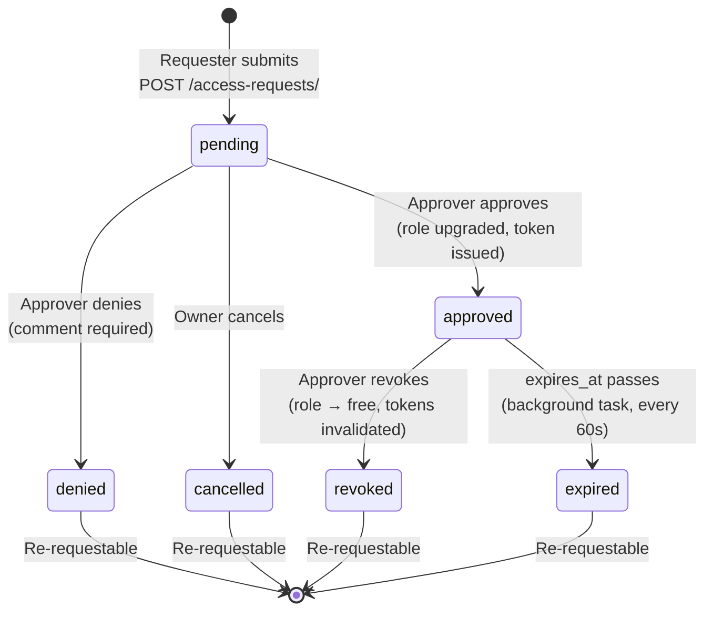

# Coding Assignment — Submission Report

**GitHub:** https://github.com/tulikundu28/MovieAnalysis  
**Docker Hub:** https://hub.docker.com/r/tulikundu/movie-analysis (tags: `1.1.1`, `latest`)

---

## Overview

A movie browsing and access-management platform, built in two parts:

1. **A movie API** serving the MovieLens public dataset, with three access tiers (public / authenticated / admin).
2. **A durable, human-in-the-loop approval workflow** that lets users request a tier, routes the request to the right approver, and — on approval — issues a scoped, time-bounded token that the movie API actually honours.

Built with **FastAPI + async SQLAlchemy Core + asyncpg + PostgreSQL 16**, packaged as a multi-arch container, and deployed on an **AWS Lightsail** Linux instance.

---

## Contents

1. [Overview](#overview)
2. [What the Service Does](#what-the-service-does)
3. [Assumptions](#assumptions)
4. [Part 1: The Movie API](#part-1-the-movie-api)
5. [Part 2: The Access Request Workflow](#part-2-the-access-request-workflow)
6. [Suggested Components: Implementation Status](#suggested-components-implementation-status)
7. [Open-Source Tools and Framework Choices](#open-source-tools-and-framework-choices)
8. [Architectural Trade-offs](#architectural-trade-offs)
9. [AI Usage](#ai-usage)
10. [Tests](#tests)
11. [Deployment](#deployment)
12. [Accessing the Live Demo](#accessing-the-live-demo)

---

## What the Service Does

A movie browsing and access management platform with two independent user populations: **movie customers** who consume movie data, and **workflow approvers** who manage access. Movie data is sourced from the MovieLens public dataset and loaded via CSV upload.

### User populations

| Population | Registration | Scale assumption |
|------------|-------------|-----------------|
| Movie customers | Self-service via `POST /users/` | Hundreds to low thousands — a community of movie enthusiasts, not a public SaaS |
| Workflow approvers | Registered via `POST /workflow-users/` (separate endpoint) | Small number — a handful of managers and admins within the organisation |

Two populations share the `users` table, distinguished by `user_type`. Both start with `role='free'` and a pending approval request.

### Roles

| Role | User type | Can do |
|------|-----------|--------|
| `free` | movie_customer | Browse movies (title only, no login needed) |
| `full_access` | movie_customer | Browse movies — full details + pagination |
| `movie_admin` | movie_customer | Full access + upload/edit movies |
| `manager` | workflow_approver | Approve/deny `full_access` requests; see own queue |
| `workflow_admin` | workflow_approver | Approve/deny `movie_admin`, `manager`, `workflow_admin` requests; revoke active access |

### Movie customer capabilities

- **Browse** movies by title, genre, year — no login required (title-only, max 20 results)
- **Register** and submit an access request for `full_access` (full details + pagination) or `movie_admin` (upload/edit)
- **Log in** once their request is approved and use their issued API token
- **Check** the status of their own access request
- **Cancel** a pending request if they change their mind (one pending request per user — a second submission returns the existing `reference_id` and a 409)
- **Re-request** access after a denial or after their access expires — they cannot submit a new request while one is still pending

### Access request rules

- **One pending request per user at any time** — enforced in `submit_access_request` via `get_pending_request_for_user`
- **Re-requestable** after denial (`status = denied`) or expiry (role downgraded back to `free` by the background task)
- **Cancellable** by the owner at any time while `status = pending`
- **Revocable** by an eligible approver at any time while `status = approved`. Revoke downgrades the user back to `free` and invalidates all their tokens, after which they may re-request.

---

## Assumptions

The access model rests on a few assumptions about who uses the system and what each tier may do.

- The system serves two distinct user populations: movie customers, who self-register and consume movie data, and workflow approvers, who are registered by an admin and manage access.
- Every user starts in the `free` tier with a single pending request, and is upgraded only once an approver acts on that request.
- Movie customers hold one of three tiers. A `free` user can browse movie titles without logging in. A `full_access` user can browse full movie details with pagination. A `movie_admin` user can additionally upload and edit movies.
- Approval authority is itself tiered. A `manager` approves `full_access` requests. A `workflow_admin` approves `movie_admin`, `manager`, and `workflow_admin` requests, and is the only role that can revoke active access.
- Access is time-bounded and re-requestable. A user may submit a new request after a denial, expiry, cancellation, or revocation, but never while a request is still pending.
- The bundled UI is a rudimentary single-page HTML interface intended only to demonstrate the workflow end to end. It is not production quality.

---

## Part 1: The Movie API

### List endpoint — returns movies, with pagination

`GET /movies/` supports cursor-based pagination via `cursor` (last seen `movie_id`) and `page_size` (default 20, max 100). The response includes a `next_cursor` field — when non-null, pass it as `?cursor=<value>` to fetch the next page. This avoids the offset-scan cost of `LIMIT/OFFSET` on large datasets.

```
GET /movies/?cursor=500&page_size=20
→ { "data": [...], "next_cursor": 520 }
```

Implemented in `repositories/movie_repository.py:search_movies` and `services/movie_service.py:fetch_movies`.

### Search endpoint — filter by title, genre, year

`GET /movies/` accepts query parameters `title`, `genre`, and `release_year`, all optional and combinable:

- **title** — `ILIKE %term%` substring match (PostgreSQL)
- **genre** — array containment (`genres @> ARRAY['Action']`) against the PostgreSQL `TEXT[]` column
- **release_year** — exact integer match

```
GET /movies/?title=toy&genre=Animation&release_year=1995
```

### Get-by-ID endpoint

`GET /movies/{movie_id}` — returns a single movie or `404` if not found. Implemented in `controllers/movie_controller.py:get_movie`.

### Python-backed, containerized

- **FastAPI** with async **SQLAlchemy Core** + **asyncpg** driver against **PostgreSQL 16**
- Multi-stage `Dockerfile` (builder stage installs dependencies, final stage copies only what's needed — no pip cache, non-root `appuser`)
- `docker-compose.yml` brings up the full stack: `db` (PostgreSQL with named volume) + `app` (FastAPI). The app waits for the DB health check before starting.
- Multi-arch image built for `linux/amd64` and `linux/arm64` via Docker Buildx

### Three access tiers

| Tier | Role | What they can do |
|------|------|------------------|
| Public | `free` (no login required) | `GET /movies/` — title only, max 20 results, no pagination |
| Authenticated | `full_access` | `GET /movies/` — full details (title, year, genres), paginated |
| Admin | `movie_admin` | Full details + `POST /movies/` (CSV upload) + `PATCH /movies/{id}` (edit) |

Tier enforcement is done at the route level using the `require_roles()` FastAPI dependency (`auth/dependencies.py`). Every protected request validates the JWT and checks the token against the `api_tokens` table (revocation check) before the handler runs.

---

## Part 2: The Access Request Workflow

### Request lifecycle

Every access request moves through this state machine. All state lives in PostgreSQL, and every transition is recorded in `audit_log`.



### 1. Request — who, what tier, why, how long

`POST /access-requests/` accepts:

```json
{
  "requested_role": "full_access",
  "reason": "Full movie details needed for research",
  "requested_expires_at": "2026-12-31T00:00:00Z"
}
```

Requires a logged-in user (any role). On submission, an `access_requests` row is created with `status='pending'` and a UUID `reference_id` is returned. The requester can paste this UUID into the UI's "Check Request Status" form to poll their status without logging in (`GET /access-requests/{ref}` — public, returns status/comment only).

Implemented in `services/access_service.py:submit_access_request`.

### 2. Route — request routed to the right approver by tier

Routing is driven by `ROLE_APPROVER_MAP` in `services/access_service.py`:

```python
ROLE_APPROVER_MAP = {
    "full_access":    "manager",
    "movie_admin":    "workflow_admin",
    "manager":        "workflow_admin",
    "workflow_admin": "workflow_admin",
}
```

When an approver calls `GET /access-requests/`, the service filters the queue to only the roles they are authorised to approve — a manager never sees `movie_admin` requests. The routing check is also enforced on the `PATCH` — if a manager tries to approve a `movie_admin` request, they get `403`.

| Requested role | Approver required |
|---------------|------------------|
| `full_access` | `manager` |
| `movie_admin` | `workflow_admin` |
| `manager` | `workflow_admin` |
| `workflow_admin` | `workflow_admin` |

### 3. Approve or reject — with optional comment

`PATCH /access-requests/{ref}` accepts `status` and an optional `review_comment`:

| status | Who can call | Effect |
|--------|-------------|--------|
| `approved` | Assigned approver | Upgrades user role, issues API token |
| `denied` | Assigned approver | Closes request (comment required) |
| `revoked` | Assigned approver | Downgrades user back to `free`, revokes tokens |
| `cancelled` | Request owner | Cancels own pending request |

Implemented in `services/access_service.py:review_access_request` and `revoke_access_request`.

### 4. Wait — durable, survives restart

All workflow state lives in PostgreSQL (`access_requests` table, `status` column). There is no in-memory state. If the container restarts while a request is pending, nothing is lost — the row is still there, the approver queue still shows it, and the approver can act on it immediately after restart.

The PostgreSQL data lives in a named Docker volume (`movies-db-data`) which survives `docker compose down` and redeployments. Only `docker compose down -v` removes it intentionally.

### 5. Issue or deny — scoped token, time-bounded

On approval:
- The user's `role` and `expires_at` are updated in the `users` table
- A JWT is signed (HS256, `python-jose`) scoped to the approved role and expiry window
- The JWT is stored in `api_tokens` (linked to the `access_requests.id`) for revocation support
- The token is returned to the approver in the API response, and the user can log in immediately.

On denial: the request is marked `denied` with the recorded comment. No token is issued.

A background task (`services/role_expiry_service.py`) runs every 60 seconds and automatically downgrades users whose `expires_at` has passed or whose tokens have all been revoked — enforcing the time-bounded access without manual intervention.

Implemented in `services/access_service.py:review_access_request` and `services/role_expiry_service.py`.

### 6. Audit — every transition recorded with who/what/when/why

Every state change appends a row to the `audit_log` table:

```
audit_log: id, request_id, actor_id, action, reason, created_at
```

Actions recorded: `submitted`, `approved`, `denied`, `revoked`, `cancelled`, `expired`.

`GET /access-requests/{ref}/audit` returns the full audit trail for a request (manager/workflow_admin only). If someone asks six months later why a user was granted admin access, the answer is one query away — actor, action, timestamp, and comment all recorded at each step.

---

## Suggested Components: Implementation Status

| Component | Implemented |
|-----------|-------------|
| Request submission endpoint | `POST /access-requests/` |
| Role-aware approval endpoints | `GET /access-requests/` filters queue by caller role; `PATCH` enforces same |
| Durable workflow | PostgreSQL-backed state + named Docker volume — survives any restart |
| Access enforcement | `get_current_user` (JWT decode + revocation check) + `require_roles()` dependency on every protected route |
| Audit log | `audit_log` table; `GET /access-requests/{ref}/audit` |
| Containerized | Multi-stage Dockerfile, `docker-compose.yml`, multi-arch Docker Hub image |

---

## Open-Source Tools and Framework Choices

| Tool | Why chosen |
|------|-----------|
| **FastAPI** | Async-first, automatic OpenAPI docs, Pydantic validation, dependency injection — all the right defaults for a JSON API |
| **PostgreSQL 16** | ACID transactions, native `UUID`, `TEXT[]` for genres, native `ENUM` types for roles/statuses, named volumes for durable state |
| **SQLAlchemy Core** (not ORM) | Explicit query control; cleaner async story than the ORM; rows-as-dicts fit the use case |
| **asyncpg** | Fastest async PostgreSQL driver; pairs naturally with SQLAlchemy async |
| **python-jose** + **passlib/bcrypt** | Standard JWT (HS256) + secure password hashing |
| **Alembic** | Schema migrations with version tracking; idempotent baseline migration so fresh installs and existing deployments converge |
| **pandas** | CSV parsing and transformation for the MovieLens dataset upload |
| **Docker Buildx** | Multi-arch (`linux/amd64` + `linux/arm64`) image from a single build command |

---

## Architectural Trade-offs

### Security

**Present**

- The API uses HS256 JWTs signed with `python-jose` and hashes passwords with bcrypt.
- All password fields are typed as `SecretStr` so they never appear in logs or tracebacks.
- A token revocation table (`api_tokens`) allows issued tokens to be invalidated immediately.
- The `require_roles()` dependency enforces tier access on every protected route.
- Secrets fail loud on startup, so the app exits if `JWT_SECRET` or `POSTGRES_PASSWORD` are unset.

**Extensions**

- Terminate TLS at an nginx reverse proxy, since the service currently runs over HTTP only.
- Issue short-lived JWTs of 15 to 30 minutes and add a refresh-token flow instead of long-lived tokens.
- Add rate limiting on `/sessions/` and `/users/` to prevent credential stuffing.
- Enable row-level security in PostgreSQL so the app user cannot read other users' data even if SQL is injected.
- Move secrets into AWS Secrets Manager or Vault to support rotation.
- Make the audit log append-only with WAL archiving to prevent tampering.

### Scalability & Performance

**Present**

- The service runs as a single FastAPI process against a single PostgreSQL instance.
- Async I/O is used throughout, so asyncpg and async SQLAlchemy avoid thread-per-request overhead.

**Extensions** (at 10x to 100x volume)

- Scale FastAPI horizontally by running multiple containers behind a load balancer, using Compose `replicas` or a Kubernetes Deployment. The app is stateless, so this is trivially horizontal.
- Add PostgreSQL read replicas to absorb movie search queries.
- Introduce a PgBouncer connection pooler, because asyncpg opens one connection per coroutine and the database reaches `max_connections` quickly under high concurrency.
- Cache the read endpoints, since `GET /movies/` and `GET /movies/{id}` are pure reads against slowly changing data.
    - Redis with `fastapi-cache2` can cache search results by a query fingerprint of title, genre, year, and cursor for a 60 to 300 second TTL, invalidated on `POST /movies/` or `PATCH /movies/{id}`.
    - A CDN or reverse-proxy cache such as nginx `proxy_cache` or Cloudflare can cache anonymous (`free`) requests at the edge, because they need no auth and return identical responses for all users. `GET /movies/{id}` is an especially good fit, with a single key, a low write rate, and a high read rate.
- Add a Redis token cache that replaces the per-request database roundtrip on `api_tokens` with a Redis set lookup of token hash to valid or revoked, which takes token checks off the hot path.
- Apply rate limiting at multiple layers as volume grows.
    - Per-IP limits on unauthenticated endpoints (`GET /movies/`, `POST /sessions/`, `POST /users/`) using nginx `limit_req_zone` or a gateway such as Kong or Traefik guard login and the free search tier.
    - Per-user limits on authenticated endpoints using token-keyed Redis counters (`slowapi`) stop one heavy user from saturating the connection pool.
    - Tighter per-user limits on write endpoints (`POST /access-requests/`, `POST /movies/`) prevent flooding the approval queue or triggering thousands of CSV upserts.
- The CSV upload currently batches at 500 rows, so very large datasets should be offloaded to a background worker such as Celery or ARQ to keep the HTTP request from timing out.

### Reliability

**Present**

- All workflow state lives in PostgreSQL, so a restart mid-flow loses nothing. Pending requests stay pending and the approver queue is unaffected.
- The Docker named volume survives `down` and redeployments.
- CSV upload uses `INSERT ... ON CONFLICT DO UPDATE`, so re-uploading the same file is safe. Seed data uses `ON CONFLICT DO NOTHING`, and the Alembic baseline is idempotent through `CREATE TABLE IF NOT EXISTS` and a `DO $$ EXCEPTION WHEN duplicate_object` block.

**Extensions**

- Add database connection retries with exponential backoff on startup, because the Compose `healthcheck` handles timing today but the app code has no retry logic.
- Add dead-letter handling to the role-expiry background loop, which currently skips a cycle silently when a transient database error occurs and should instead log and alert.
- Add idempotency keys to `PATCH /access-requests/{ref}` to prevent double-approval when a client retries a timed-out request.

### Auditability

**Present**

- Every state transition writes a row to `audit_log` capturing `actor_id`, `action`, `reason`, and `created_at`.
- The internal integer `access_requests.id` is used only as the foreign key and is never exposed, while all external references use the UUID `reference_id`.
- `GET /access-requests/{ref}/audit` returns the complete trail, so querying by `reference_id` and joining `audit_log` shows who submitted, who approved, with what comment, and when.
- The `reviewed_by` column on `access_requests` records the approver directly on the request row.

**Extensions**

- Ship `audit_log` to an append-only store such as S3 with Athena, or a SIEM, on a schedule so the trail survives even a database loss.

### Cost

**Present**

- One Lightsail instance at roughly $5 to $10 per month runs both containers.
- The image uses the Docker Hub free tier and the repository uses the GitHub free tier.
- PostgreSQL data lives on the instance's local disk in a Docker volume.

**Extensions**

- A managed RDS PostgreSQL instance adds roughly $25 to $50 per month for a `db.t4g.micro` but removes the operational burden of backups, failover, and patching.
- Running the app container and RDS on separate instances means the database is not lost if the instance is replaced.
- CloudWatch or Grafana monitoring adds minimal cost and is essential for production visibility.
- The multi-arch image runs on ARM instances such as Graviton, which are roughly 20% cheaper than x86 equivalents for the same workload.

---

## AI Usage

Claude Code (Claude Sonnet, Anthropic's terminal CLI) was used throughout this project:

- **Scaffolding** — initial project structure, SQLAlchemy table definitions, FastAPI router wiring
- **Design** — worked through the two-phase commit pattern for user+access_request creation, the login sentinel approach for the `api_tokens` FK constraint, and the `ROLE_APPROVER_MAP` routing design
- **Debugging** — diagnosed the duplicate CSV upload 500 (IntegrityError → fixed with `pg_insert().on_conflict_do_update()`), traced the `/mine` 500 back to PostgreSQL attempting a UUID cast on the string "mine"
- **Code review** — flagged dead code (unused repository functions, an unreachable service path), caught the hardcoded `localhost:8000` in the UI, enforced REST conventions (`?owner=me` instead of a `/mine` sub-route, optional-auth on `GET /{ref}` instead of a separate `/lookup/` path)
- **Testing** — adding the unit and integration test suites, including fixtures, mocked repositories, and the per-test database reset
- **Documentation** — `instruction.md`, inline log messages

Where it accelerated: boilerplate (Dockerfile, Alembic env.py, GitHub Actions workflow YAML) and cross-cutting changes (adding structured logging across all files, centralising all errors into `utils/errors.py`).

Where it needed course-correction:

- **Workflow engine over-engineering:** AI initially suggested adopting a fully managed workflow engine (Temporal, Prefect) for the approval state machine. This was the right instinct for a complex, multi-step workflow with retries and timeouts — but for a linear three-state machine (`pending → approved/denied/revoked`) with no branching, no async side-effects, and a team of one, it was significant operational overhead (running a Temporal cluster, learning its SDK, mapping the data model). The decision was to use PostgreSQL as the state store directly — simpler, already a dependency, and sufficient for the durability requirement. The trade-off is explicitly called out under Reliability.

- **Non-REST route design:** AI proposed `/access-requests/lookup/{ref}` as a separate public lookup path, and `/access-requests/mine` as a sub-route for the user's own requests. Both were corrected. The former became optional-auth on the standard `GET /access-requests/{ref}` endpoint, where unauthenticated callers get a public status view and authenticated callers get full detail. The latter became `GET /access-requests/?owner=me`, using a query parameter rather than a path segment.

- **Separate cancel and delete endpoints:** AI initially generated `POST /access-requests/{ref}/cancel` for cancellation and `DELETE /access-requests/{ref}` for revocation. Both violate REST — cancel and revoke are status transitions, not resource creation or deletion. Corrected to `PATCH /access-requests/{ref}` with `{"status": "cancelled"}` and `{"status": "revoked"}` respectively, routed through the same status-transition endpoint.

- **Internal IDs leaking into the API:** AI returned the integer `id` from `access_requests` in several response bodies. The design decision was that the internal PK is never exposed — all external references use the UUID `reference_id`. This was caught during review of the registration response and the UI's request submission handler (`data.id` → `data.reference_id`).

Validation approach: every AI-generated change was read before accepting, imports were checked, and the server was started to test the affected flow end-to-end. Unit tests (42 total) provided a regression safety net for service-layer changes.

---

## Tests

**99 tests total** — 42 unit (mock the repository layer with `AsyncMock`, no database) and 57 integration (real PostgreSQL, FastAPI app mounted directly via `httpx.AsyncClient`, no running server needed).

```bash
python -m pytest tests/unit/ -v                                       # 42, no DB
POSTGRES_TEST_DB=moviesdb_test python -m pytest tests/integration/ -v  # 57, needs DB
```

The `clean_db` autouse fixture truncates all tables and reseeds the admin user + login sentinel before every integration test, so tests are fully isolated.

### Main paths covered

| Area | Happy path | Unhappy path |
|------|-----------|--------------|
| Auth & login | Register returns UUID `reference_id`; login returns a scoped `bearer` token | Duplicate email → 409, wrong password → 401, weak password → 422 |
| Movie search | Filters by title/genre/year; cursor pagination advances; no auth required | No match → empty list; `page_size` over max → 422 |
| Movie write (admin) | `movie_admin` uploads/edits; re-upload is idempotent (upsert) | No auth or `full_access` token → 403; unknown ID → 404 |
| Submit request | Submit; re-request after denial or cancellation | Duplicate pending → 409 (returns existing `reference_id`); no auth → 403 |
| Approve / deny | Assigned approver approves (token issued) or denies | Wrong approver scope → 403; double-approve → 409; deny without comment → 400 |
| Revoke | Approver revokes; revoked token is immediately rejected (401) | Revoke a non-approved request → 409 |
| Audit | Full lifecycle recorded (submitted → approved → revoked) | Non-approver reads audit → 403 |

The full end-to-end test exercises the whole loop: register → approve → use token → revoke → token rejected → resubmit.

---

## Deployment

### Local development

```bash
# Start PostgreSQL
docker compose up -d db

# Install dependencies
python -m venv .venv && source .venv/bin/activate
pip install -r requirements.txt

# Run the API (auto-reload on file change)
uvicorn main:app --reload
```

API: `http://localhost:8000` · UI: `http://localhost:8000/` · Docs: `http://localhost:8000/docs`

### Full stack with Docker Compose

```bash
docker compose up -d
```

- Starts both `db` (PostgreSQL 16) and `app` (FastAPI). The app waits for the DB health check before starting.
- Schema and seed data are applied from `init.sql` on first boot.
- Data persists in the `movies-db-data` named Docker volume — it survives `docker compose down`. Only `docker compose down -v` removes it.

```bash
docker compose logs -f app   # tail logs
docker compose down          # stop (data preserved)
docker compose down -v       # stop + wipe database
```

### Container image

The image is published to Docker Hub as a multi-architecture build (`linux/amd64` + `linux/arm64`) so it runs on both standard x86 instances and ARM-based instances (AWS Graviton):

```
docker pull tulikundu/movie-analysis:latest
```

### CI/CD pipeline (GitHub Actions)

Pushing a SemVer tag (`v1.x.y`) triggers `.github/workflows/docker-publish.yml` automatically:

1. Checks out the code
2. Sets up QEMU (cross-compilation) and Docker Buildx
3. Uses `docker/metadata-action` to derive all four tags from the Git tag
4. Builds `linux/amd64` + `linux/arm64` in parallel with layer caching (`cache-from: type=gha`)
5. Pushes all tags to Docker Hub

```bash
git tag v1.1.1 && git push origin v1.1.1   # triggers the pipeline
```

### Deploying to a Linux instance (Lightsail)

Only three files are needed on the server — the app code ships inside the image:

```
docker-compose.yml
docker-compose.prod.yml
init.sql
```

```bash
# Export secrets (no .env file on disk in production)
export POSTGRES_USER=postgres
export POSTGRES_PASSWORD=<strong-password>
export POSTGRES_DB=moviesdb
export JWT_SECRET=<random-hex-32>

# Pull and start
docker compose -f docker-compose.yml -f docker-compose.prod.yml up -d --no-build
```

`docker-compose.prod.yml` overrides: `APP_ENV=prod` (silences SQL query logs), `restart: unless-stopped`, no DB port exposed to the host.

For routine updates, a helper script at `/home/ec2-user/movie-analysis/redeploy.sh` pulls the latest image from Docker Hub and restarts the stack, so shipping a new release on the instance is a single command:

```bash
/home/ec2-user/movie-analysis/redeploy.sh
```

### Alembic migrations

- The app runs `alembic upgrade head` automatically on startup.
- Fresh installs skip the baseline migration — the schema is already applied by `init.sql`, which stamps `alembic_version = 0001`.
- Subsequent migrations run normally.

To rebuild the database from scratch (required after `init.sql` schema changes):

```bash
docker compose down -v && docker compose up -d
```

---

## Accessing the Live Demo

The application is running on an AWS Lightsail instance. Access is via an SSH tunnel from your local machine:

```bash
ssh -L 16000:localhost:8000 ec2-user@3.107.76.63 -i lightsail.pem
```

Once the tunnel is open, the app is available at:

| URL | Description |
|-----|-------------|
| `http://localhost:16000/` | Bootstrap 5 single-page UI |
| `http://localhost:16000/docs` | Interactive Swagger API docs |
| `http://localhost:16000/healthz` | Health check |

### Test accounts

The following accounts are pre-created on the live instance and can be used for the end-to-end demo.

**Workflow Approvers**

| Email | Password | Role | Can approve |
|-------|----------|------|-------------|
| tuli.ku09@gmail.com | TestAdmin123 | `workflow_admin` | `movie_admin`, `manager`, `workflow_admin` requests |
| manager@gmail.com | Manager123 | `manager` | `full_access` requests |

**Movie Customers**

| Name | Email | Password | Role |
|------|-------|----------|------|
| Test User | test_user@gmail.com | TestUser123 | `full_access` |
| Test User1 | test_user1@gmail.com | TestUser1234 | `movie_admin` |

> Both movie customer accounts have already been approved and can log in immediately.
